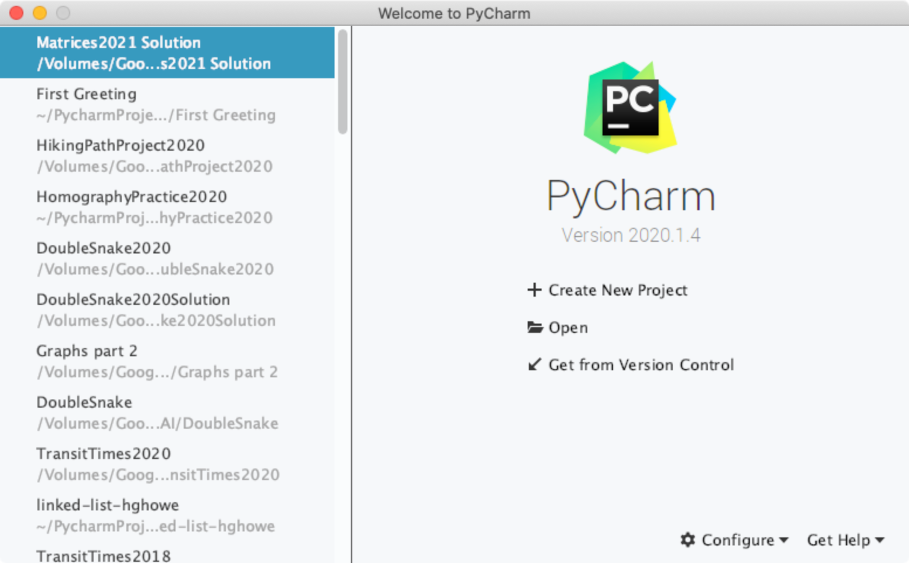
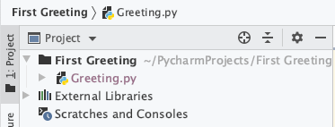
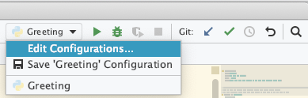

CLA&S	August 19, 2020

## First Python-Github Project

This first project is _much_ more cookie-cutter than usual, but is intended as a quick way to get you familiar with the basics of Github classroom and how you will be turning projects in this year. For those of you already familiar with Github, this is very basic - we're not talking about branches or pull requests or any of the fancier stuff found there.

1. Go to [GitHub.com](https://github.com/) and create an account for yourself, if you have not already done so. You can use your Kinkaid email for this - when we get to the end of the year, you can transfer it to a new email pretty easily, so that you can keep your stuff!
2. Now go to [https://classroom.github.com/a/oytTTVEI](https://classroom.github.com/a/oytTTVEI) and select your name from the list to link your name to the github account. 
3. On the next screen, accept the first greeting assignment.
4. After a brief pause, you'll get a message saying you're ready to go, with a url on it. Go ahead and click on this URL. You'll see something like this: 

5. Click on the green "Code" button. You'll see the start of a (mighty similar) URL here, too. Click on the clipboard icon next to it to copy this URL into your clipboard. (Leave this window open as we switch to a different program - we'll be back here soon.)
6. Now launch PyCharm on your computer. Close any project windows you have open, so that you are seeing the "Welcome to Pycharm" window.
On the right side, click "Get from Version Control." 
7. In the "URL" field, paste the URL you copied in step 5, select a location where you would like to put the project (one is suggested), and click "Clone." This should download a copy of my starter project, open a project window,  and create a "local" repository on your computer. \
_The repository is a hidden folder on your computer that keeps a record of this project and the changes you make to it. So you actually have two copies of the project now. When you save the project (or run it, which should autosave it), that updates the version that is visible. When you "commit" your project, it updates the repository, as we will see._
8. Open up the "Greeting.py" file in your project. (You may need to open the "First Greeting" folder in the Project pane to find it.)

Peruse this simple file - we are defining a method, "do_greeting()," which prints some fairly banal stuff. Below, if this is the file we are telling to run, we call that method.
9. Go to the "Run" menu, select "Run…" and choose "Greeting.py." You should see some fairly predictable output in the line below. \
If you are _not_ given "Greeting.py" as an option...
    1. It is likely that you need to choose an interpreter for the program. In the upper right corner, there is a popup menu to the left of the green arrow. (It will likely not look exactly like mine, but similar.) \
Choose "Edit Configurations…"
    2. In the window that appears, look for the popup marked "Python Interpreter." (It should be about halfway down the right side of this window. Use this to select Python 3.8. (If you see more than one, try one at a time until you find one that works - and remember it for next time.) Click Ok and try step 9 again. If this _still_ doesn't work, contact Mr. Howe.
10. We are going to make a simple change to the file. On line 4, replace the dash with your name. Run the program again. _Hint: once you have run the program once, there are Green "run" triangles in several places on the screen, including the upper right corner, the left side of the "Run" panel, and maybe even next to line 12. Any of these can be used to run the program now. Or type control - r._ \
You should see your modified program results in the Run panel.
11. Since we've successfully made a change to our program (albeit a very small one), let's update our repository. In the "VCS" menu, select "√ Commit." (_You might also see a section for "Git" in the upper right corner of the editor window with a green check; that is the same thing. Or type command-k_.) You'll be presented with a window: in the top panel, a list of files in your project, with a check next to the ones that have had changes we wish to "commit" to the repository. Greeting.py should be checked. In the next panel down, is a "Commit Message." Type about one sentence here saying what has changed. (e.g., I replaced the dash with my name.") Below that is the "diff" section, which should highlight what you have changed in the file. \
Click the "Commit" button in the lower right corner.
12. Go ahead and update line 6 of the program - replace the contents of the parentheses with an f-string that displays the contents of the "color" variable in a sentence. (e.g., so that it will print "My favorite color is blue.") Test that changing the color variable displays correctly.
13. When this is working, do a second commit to your repository.
14. What we have done so far is all local to your computer - but there is a third copy of your project - it is the repository online on the GitHub webpage you visited earlier. Periodically, you need to update that online repository with the contents of your personal repository. This is called a "Push." Go to the VCS menu and select "Git" → "Push…." You should see a list of all the commits you made on the left. Click "Push" in the lower right to send your files on to GitHub.
15. Let's see what this looks like on the web. Return to the github repository page you left earlier. Refresh the webpage. You should see that the "Greeting.py" now shows the text of your last commit on it. In fact, if you click on "Greeting.py," it should show the current version of your file.
16. Either hit the Back button in your browser or use the breadcrumbs at the top left corner to return to your project file listing. In the blue bar, below the "Code" button (from right to left)  the number of commits (some of which were automatically generated), when the most recent commit was, and a 7-digit hexadecimal number/hyperlink.[^1] Copy this number (on paper is fine). To turn in this project to Mr. Howe, go to Powerschool, find this assignment again, click on "Hand in," type in this hexadecimal number (long or short) in the large text field, and click "Submit." That will tell Mr. Howe that you are ready for him to take a look at your project - and the number will help him make sure he is looking at the correct version. \
_Note: In the future, you can also get this number inside PyCharm, without going back to the webpage. Go to "View" menu → Tools → Git (or type command-9). In the panel that appears, click on "Log" at the top. You'll see a variety of commits listed, but if you've just done a push, you should see "origin & master" flagged in the top row - at the right side is the commit ID. You can right-click and select "Copy Commit ID."_

<!-- Footnotes themselves at the bottom. -->
## Notes

[^1]: This is the first 7 digits of a much longer hex number. Click on the link to see the full number! It will be on the right hand side, below the blue bar.

